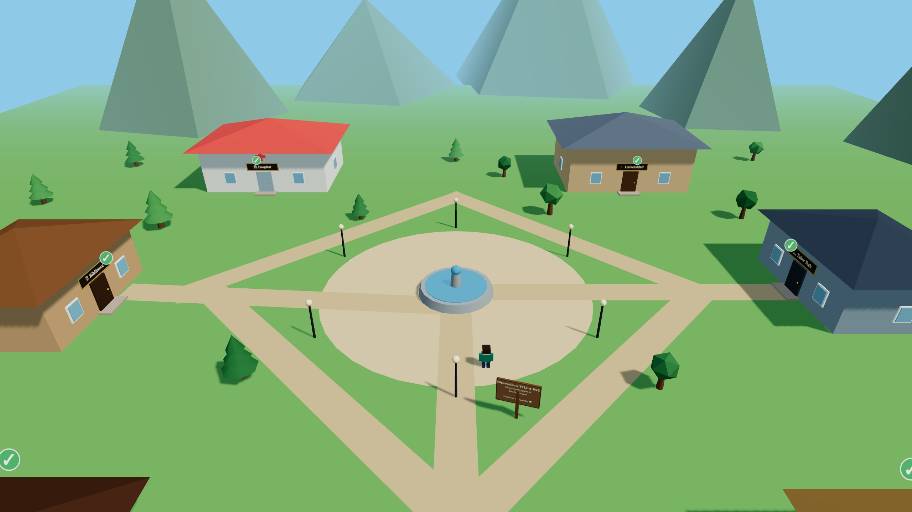

# 🏘️ Villa Pau — El currículum jugable

**Un CV que no se lee: se explora.** Villa Pau es el currículum interactivo en 3D de
**Pau Díaz Masero**, construido como un pequeño videojuego web con
[Three.js](https://threejs.org) como motor gráfico.

🎮 **Juégalo aquí → [pdiazmas.github.io](https://pdiazmas.github.io)**



## 🗺️ ¿Cómo funciona?

Controlas a un visitante que recorre un pueblo en 3D. Cada edificio guarda una sección
del currículum y dentro vive un lugareño al que puedes hacerle las **preguntas
frecuentes** de esa sección, como en un RPG:

| Lugar | Lugareño | Sección del CV |
| --- | --- | --- |
| 🏡 Casa de Pau | Pau | Sobre mí |
| 🏥 Hospital | Dra. Vidal | Experiencia laboral (radiología y enfermería) |
| 🎓 Universidad | Prof. Ferrer | Educación |
| ☕ Café Políglota | Marta | Idiomas |
| 💻 Taller Tech | Nora | Proyectos y tecnologías |
| 📚 Biblioteca | Marc | Faceta literaria |
| 📮 Oficina de Correos | Quim | Contacto y redes |

## 🕹️ Controles

- **Moverse:** `WASD` / flechas, o joystick virtual en móvil
- **Entrar / hablar:** `E`, `Espacio`, `Enter` o el botón táctil
- **Cerrar diálogo:** `Esc` o «Hasta luego 👋»
- **Día / noche:** botón 🌙 del HUD (se encienden farolas, ventanas y estrellas)

El progreso (lugares visitados) se guarda en el navegador.

## 🛠️ Tecnología

- **Three.js** como único motor gráfico (vía CDN con import maps, sin build ni bundler)
- **JavaScript vanilla** (módulos ES)
- Todo el arte 3D es **low-poly procedural**: personajes, edificios, interiores y
  carteles se generan por código (geometrías básicas + texturas dibujadas en canvas).
  No hay modelos ni assets externos.
- Sistema de diálogos con efecto máquina de escribir, colisiones, ciclo día/noche y
  controles táctiles hechos a mano.

```
├── index.html          # Punto de entrada y capas de interfaz (HUD, diálogos, intro)
├── css/game.css        # Estilos de la interfaz 2D
└── js/game/
    ├── main.js         # Bucle del juego, cámara, colisiones, estado
    ├── data.js         # Contenido del CV convertido en lugares y diálogos
    ├── world.js        # El pueblo: edificios, plaza, montañas, cielo
    ├── interiors.js    # Interiores temáticos de cada edificio
    ├── assets.js       # Fábricas de mallas low-poly y texturas por canvas
    └── ui.js           # Diálogos, HUD, joystick virtual y transiciones
```

## 🚀 Ejecutar en local

Al usar módulos ES necesita servirse por HTTP:

```bash
python3 -m http.server 4173
# o: npx serve
```

y abrir `http://localhost:4173`.

## 📬 Contacto

[💼 LinkedIn](https://www.linkedin.com/in/pau-díaz-masero-3b328a102/) ·
[🐙 GitHub](https://github.com/pdiazmas) ·
[📷 Instagram](https://www.instagram.com/pau_diaaz_/)

---

Hecho con ❤️ y Three.js por Pau Díaz Masero
